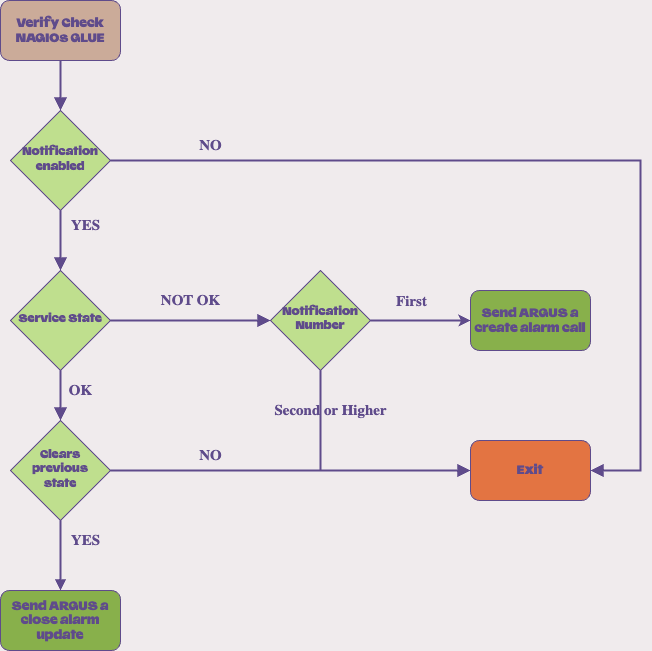

# Nagios <-> Argus glue service

This is a glue service for integration between
[Argus](https://github.com/Uninett/Argus), the alert aggregation server, and
[Nagios](https://www.nagios.com), the IT infrastructure monitoring tool.

## How it works

`nagios_argus_glue` acts as a script meant to be triggered on each nagios check.
Provided that the check is enabled for notification and it matches the criteria of raising a new or 
closing an existing alarm, an update will be sent to Argus using the Argus API.

### Criteria Flow



## Configuration

Make use of the Obsess Feature in Nagios to use this glue-service.
Enable OSCP in nagios.cfg:

```nagios_cfg
"obsess_over_services=1"

"ocsp_command=obsessive_service_handler"
```

Then define a new command named `obsessive_service_handler`:

```commands.cfg
define command {
  command_name obsessive_service_handler
  command_line /opt/Custom-Nagios-Plugins/nagios_argus_glue.py --description '$SERVICEDESC$ $SERVICEOUTPUT$' --hostname '$HOSTNAME$' --servicestateid '$SERVICESTATEID$' --lastservicestateid '$LASTSERVICESTATEID$' --lastproblemid '$LASTSERVICEPROBLEMID$' --problemid '$SERVICEPROBLEMID$' --notification '$SERVICENOTIFICATIONENABLED$' --notification_number '$SERVICENOTIFICATIONNUMBER$'
}
```

Apply the same logic for `obsess_over_hosts` and `obsessive_host_handler`

#### Powered by


